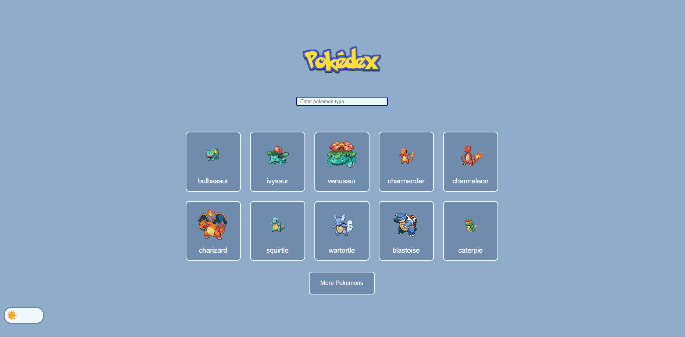
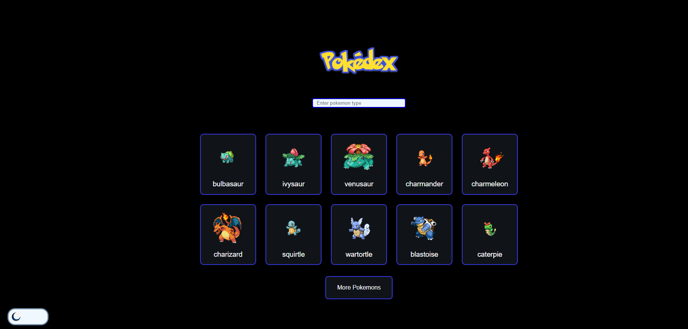
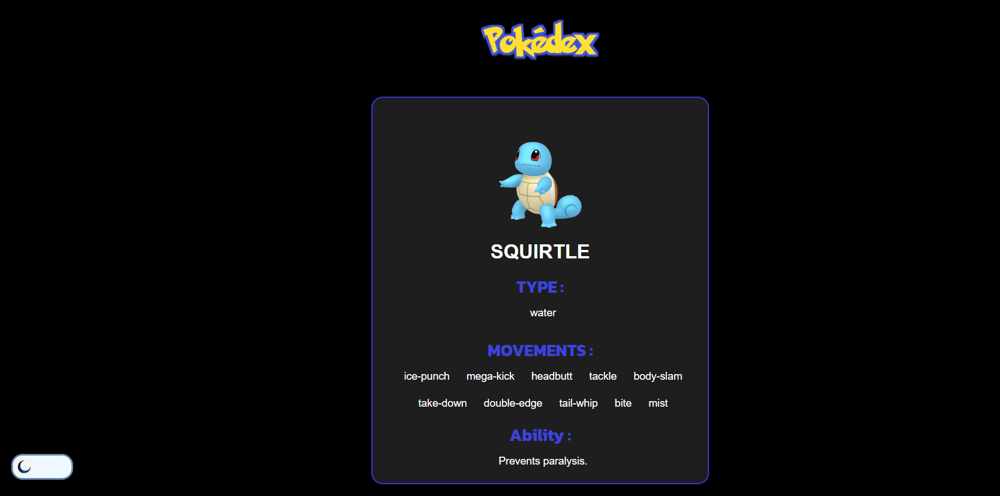
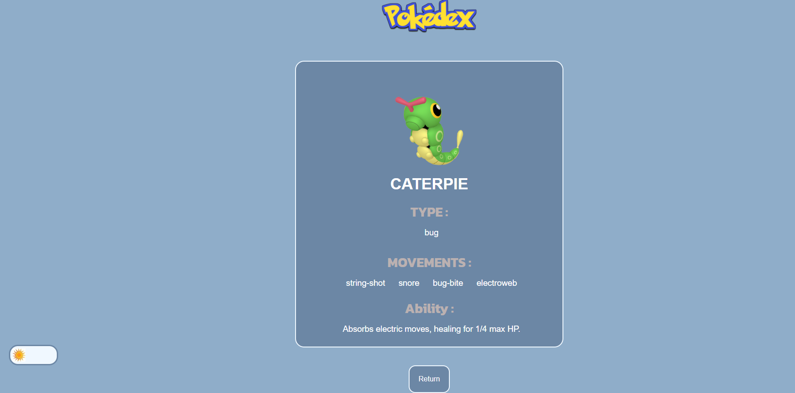
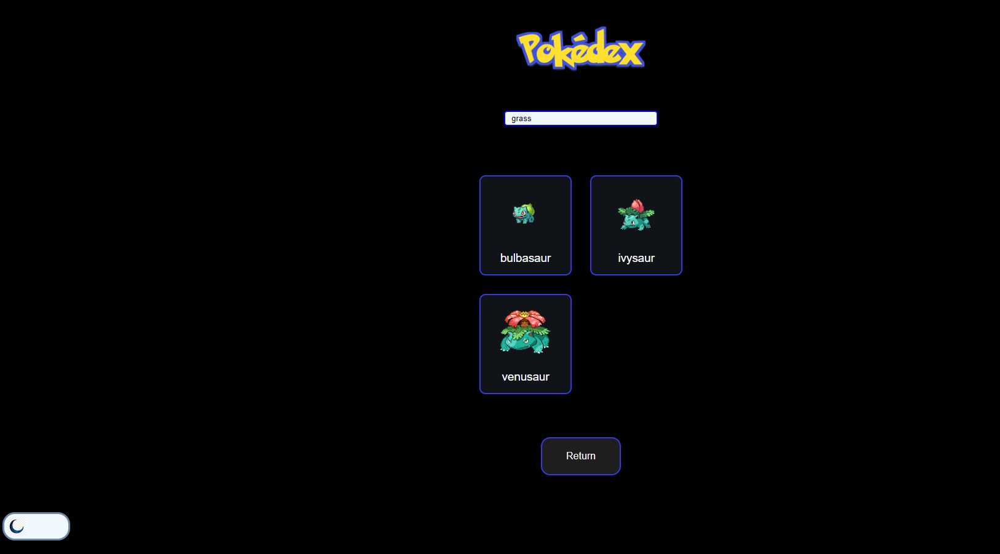
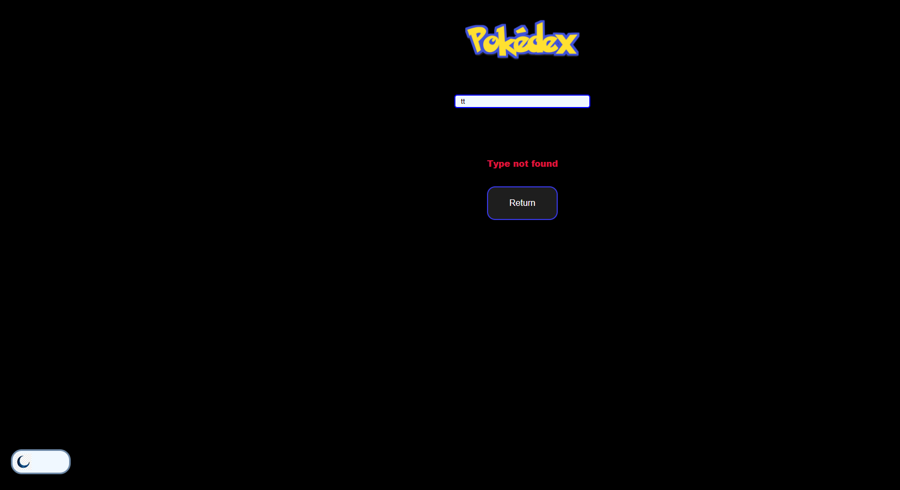

# Projeto Pokedex 🐱‍💻

Esse código consiste em simulação de uma tela de um <strong>Pokedex</strong>.
<strong>Pokedex</strong> é uma enciclopédia virtual como se fosse um celular que tem em seu banco de dados de todas as espécies de Pokemons

    

## Responsividade
Um dos conceitos mais importantes nos dias de hoje é integrar um aplicativo que se adequa a varios tamanhos de tela, como desktop, tablets, smartphones etc. E o meu projeto foi elaborado pensando nisso.

## Funcionabilidades do projeto
O usuário pode escolher qualquer um dos 10 pokemons exibido em tela, ao selecionar o mesmo será direcionado para uma tela de 'details' do pokemon,contendo as informações como : Movimentos, Habilidades e tipo de cada pokemon. 
Caso o usuário queira mais opções de pokemons basta clicar no botão "More Pokemons" que será carregado mais 10 pokemons. A interface  disponibiliza um campo onde o usuário pode escrever o tipo do pokemon que procura para serem filtrados,  entregando assim pokemons somente daquele tipo.

    

## Tecnológias utilizadas 

  ### Linguagens

* JavaScript 
  

 
 * HTML 
  

 * CSS 
  
   
   
   
  ### Bibliotecas
  * Vite 
    
   <strong>Vite</strong> por sua forma de inicializar a construção  com grande rápidez o código.
    
    
* React 
   
  <strong>React</strong> foi implementado por ser grande referencia na área, disponibilizando diversos métodos e funcionabilidades de grande auxilio.
   
   

* React Router Dom  
     Biblioteca que realiza a navegação entre páginas com grande fluídes, permitindo ser aplicado a funcionabilidade de SPA.
     
     

 * Styled Components  
     
    Tecnologia que fornece uma estilização mais dinâmica aos componentes com os templete literals.
     
     

  * Axios 
       Eficiência nas requisições HTTP. 
     
     
  
  ## Planejamento
  Como essa é uma aplicação contendo páginas divergentes que realiza requisições em banco de dados, foi imprescindível o uso de certas bibliotecas para deixar o código mais limpo e compreensível possível. 
  Com auxílio dessas bibliotecas o código foi estruturado, tanto a página  'home' como a 'details'. A <strong>home</strong> renderiza os 10 pokemons inicias em tela e ao clicar no botão 'more Pokemons' carrega mais 10 pokemons novos rendeizando o total 20 pokemons em tela para isso foi realizado duas requições de API, então foi assim que a criação do código se iniciou. Depois que a página <strong>home</strong> foi finalizada era vez da <strong>Details</strong>, houve a chamada de duas requições para capturar todos os dados pedidos, foi necessário a criação de alguns componentes com o intuito de  organizar melhor a aplicação, foi um pouco custoso para encontrar todos os dados pois havia diversos objetos contendo informações. Outra dificuldade inconveniente foi um erro de validação do retorno da API, mas com empenho e pesquisa esse erro foi superado com um simples operador ternário. 
  O aplicativo disponíbiliza um botão de 'Theme' que muda as cores da interface permintindo que o usuário possa escolher entre o tema Ligth ou Dark em todas as páginas, foi utilizado o hook 'UseContext' fornecido pela depêdencia do React para ser possível essa proeza. 
  Hoje em dia é essêncial desenvolver aplicativos que se adaptam a todos os tamanhos de telas, tendo isso em mente esse código é totalmente responsivo para desktop, smartphones e tablets. 
  E por fim foi criado um campo que filtra os pokemons de acordo com o tipo que o usuário digitou, a maior dificuldade foi arrumar a responsividade do código, como o filtro diminui a lista de pokemon o tamanho do conteúdo muda drasdicamente sendo assim bagunçando toda a estilização editada anteriormente.

  

## Passo a Passo
### Escolha o Pokemon 
* Interface da tela <strong>home</strong> carregada será disponibilizado para a escolha 10 pokemons, ao clicar em qualquer um desses será renderizado a página de <strong>Details</strong> do escolhido, contendo os atributos do mesmo.

     
     
     
     

  ### Mais Pokemons para escolha
* Ainda na tela <strong>home</strong> logo abaixo dos pokemons contém um botão 'More Pokemons' que quando o mesmo é clicado é inserido mais 10 pokemons na lista de escolha, fornecendo assim 20 pokemons ao usuário.

* Quando os 20 pokemons forem renderizados aparecerá o botão 'less pokemon' que ao ser clicado o total de pokemons será reduzido para 10 pokemons novamente. 

   
   
   
   

  ### Alterar tema

* No canto inferior esquerdo tem um botão que altera o aspecto do aplicativo permintindo que o usuário possa escolher entre o tema Ligth ou Dark tanto na página <strong>home</strong> como  na página <strong>Details</strong>.

#### Home

 

#### Details

   
   
   
   

* Página <strong>Details</strong> aberta será exibido as informações do pokemon escolhido, logo abaixo tem um botão de 'Return' para voltar a tela 'home' inicial.   

 
 

   
   
   
   

#### Busca
* Barra de pesquisa que busca o tipo específico de um pokemons, é só digitar o tipo que ele procura.

   
   
  
Se usuário digitar um tipo de pokemon que não existe no banco de dados da pokedex, aparecerá uma mensagem de erro.

